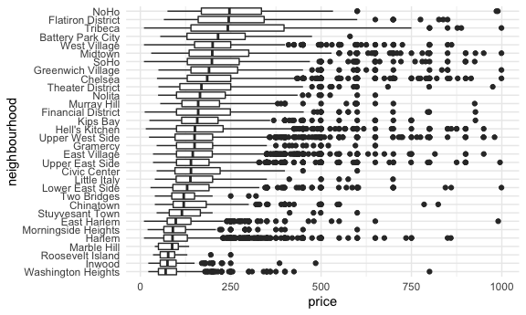

case study
================
Pallavi Krishnamurthy

## load airbnb package

``` r
data("nyc_airbnb")
```

## Brainstrom with this dataset

*what is the best airbnb in staten island for \<$100 *what price range
is the most popular? *what apartment features are related to the price?
*cheapest room type in each neighbourhood? \*hosts that have high
ratings?

## Answer some questions

data cleaning

``` r
nyc_airbnb = 
  nyc_airbnb %>% 
  mutate(stars = review_scores_location / 2)
```

``` r
 nyc_airbnb %>% 
  count(neighbourhood_group, room_type) %>% 
  pivot_wider(names_from = room_type, values_from = n)
```

    ## # A tibble: 5 x 4
    ##   neighbourhood_group `Entire home/apt` `Private room` `Shared room`
    ##   <chr>                           <int>          <int>         <int>
    ## 1 Bronx                             192            429            28
    ## 2 Brooklyn                         7427           9000           383
    ## 3 Manhattan                       10814           7812           586
    ## 4 Queens                           1388           2241           192
    ## 5 Staten Island                     116            144             1

``` r
nyc_airbnb %>% 
  group_by(neighbourhood_group, room_type) %>% 
  summarize(mean_price = mean(price))
```

    ## `summarise()` regrouping output by 'neighbourhood_group' (override with `.groups` argument)

    ## # A tibble: 15 x 3
    ## # Groups:   neighbourhood_group [5]
    ##    neighbourhood_group room_type       mean_price
    ##    <chr>               <chr>                <dbl>
    ##  1 Bronx               Entire home/apt      125. 
    ##  2 Bronx               Private room          65.5
    ##  3 Bronx               Shared room           57.5
    ##  4 Brooklyn            Entire home/apt      175. 
    ##  5 Brooklyn            Private room          76.7
    ##  6 Brooklyn            Shared room           59.6
    ##  7 Manhattan           Entire home/apt      238. 
    ##  8 Manhattan           Private room         107. 
    ##  9 Manhattan           Shared room           84.7
    ## 10 Queens              Entire home/apt      140. 
    ## 11 Queens              Private room          70.6
    ## 12 Queens              Shared room           49.1
    ## 13 Staten Island       Entire home/apt      207. 
    ## 14 Staten Island       Private room          65.4
    ## 15 Staten Island       Shared room           25

``` r
nyc_airbnb %>% 
  filter(neighbourhood_group == "Manhattan") %>% 
  count(neighbourhood)
```

    ## # A tibble: 32 x 2
    ##    neighbourhood          n
    ##    <chr>              <int>
    ##  1 Battery Park City     65
    ##  2 Chelsea             1072
    ##  3 Chinatown            360
    ##  4 Civic Center          42
    ##  5 East Harlem         1048
    ##  6 East Village        1858
    ##  7 Financial District   391
    ##  8 Flatiron District     90
    ##  9 Gramercy             307
    ## 10 Greenwich Village    383
    ## # … with 22 more rows

``` r
nyc_airbnb %>% 
  filter(
    price < 1000,
    neighbourhood_group == "Manhattan") %>% 
  mutate(neighbourhood = fct_reorder(neighbourhood, price)) %>% 
  ggplot(aes(x = neighbourhood, y = price)) +
  geom_boxplot() +
  coord_flip()
```


